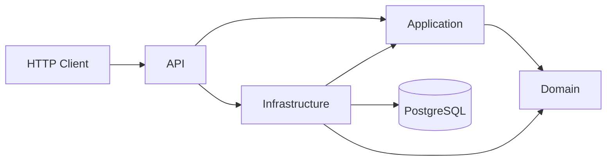

# ProductionReadyApi

A compact, production-oriented ASP.NET Core backend sample built with **.NET 10**, **C#**, **PostgreSQL**, **Entity Framework Core**, **Docker**, automated tests and **GitHub Actions CI**.

The project intentionally stays small enough to understand quickly while demonstrating patterns that matter in real backend systems: layered architecture, validation, error handling, persistence, health checks, OpenAPI, database migrations, integration tests and CI/CD.

## What this repository demonstrates

- ASP.NET Core Web API
- C# / .NET 10
- PostgreSQL with Entity Framework Core
- Layered architecture (`Domain`, `Application`, `Infrastructure`, `Api`)
- RESTful CRUD endpoints
- Pagination and search
- Domain and application validation
- Global exception handling with RFC 7807 `ProblemDetails`
- Unique database constraints
- Database health checks
- OpenAPI document generation
- Docker + Docker Compose
- Unit tests with xUnit.net v3
- Integration tests with an isolated SQLite database
- Microsoft Testing Platform (MTP)
- GitHub Actions build/test pipeline
- Dependabot configuration

## Architecture

```text
HTTP Client
    |
    v
+---------------------------+
| ProductionReadyApi.Api    |
| Controllers / HTTP        |
+-------------+-------------+
              |
              v
+---------------------------+
| Application               |
| Use cases / validation    |
+-------------+-------------+
              |
              v
+---------------------------+
| Domain                    |
| Business rules / entities |
+---------------------------+
              ^
              |
+-------------+-------------+
| Infrastructure            |
| EF Core / PostgreSQL      |
+---------------------------+
```

Dependency direction:

```text
Api ---------> Application ---------> Domain
 |                  ^
 |                  |
 +-> Infrastructure+
        |
        +---------------------------> Domain
```

GitHub also renders the same flow as a Mermaid diagram:



## Domain

The sample manages products with the following properties:

```text
Id
Sku
Name
Price
StockQuantity
CreatedAt
UpdatedAt
```

`Sku` is unique at database level.

## Run with Docker

Prerequisite: Docker Desktop or Docker Engine with Compose.

```bash
docker compose up --build
```

The API is then available at:

```text
http://localhost:8080
```

OpenAPI JSON:

```text
http://localhost:8080/openapi/v1.json
```

Health endpoints:

```text
http://localhost:8080/health       # all checks
http://localhost:8080/health/live  # process liveness
http://localhost:8080/health/ready # database readiness
```

Stop everything:

```bash
docker compose down
```

Remove the local PostgreSQL volume as well:

```bash
docker compose down -v
```

## Run locally without Docker for the API

Start PostgreSQL first, for example with:

```bash
docker compose up postgres -d
```

Then:

```bash
dotnet restore
dotnet run --project src/ProductionReadyApi.Api
```

The default local development connection string is stored in `appsettings.json` and can be overridden with environment variables or user secrets.

## API examples

### Create product

```bash
curl -X POST http://localhost:8080/api/products \
  -H "Content-Type: application/json" \
  -d '{
    "sku": "KB-001",
    "name": "Mechanical Keyboard",
    "price": 129.90,
    "stockQuantity": 25
  }'
```

### Get product

```bash
curl http://localhost:8080/api/products/{id}
```

### Search and paginate

```bash
curl "http://localhost:8080/api/products?search=keyboard&page=1&pageSize=20"
```

### Update product

```bash
curl -X PUT http://localhost:8080/api/products/{id} \
  -H "Content-Type: application/json" \
  -d '{
    "sku": "KB-001",
    "name": "Mechanical Keyboard Pro",
    "price": 149.90,
    "stockQuantity": 18
  }'
```

### Delete product

```bash
curl -X DELETE http://localhost:8080/api/products/{id}
```

## Validation examples

Invalid requests return an RFC 7807 compatible response:

```json
{
  "type": "https://httpstatuses.com/400",
  "title": "Validation failed",
  "status": 400,
  "detail": "One or more validation errors occurred.",
  "errors": {
    "sku": ["SKU is required."],
    "price": ["Price must be greater than or equal to 0."]
  }
}
```

Duplicate SKU values return HTTP `409 Conflict`.

## Tests

Run all tests:

```bash
dotnet test
```

Run all tests with Cobertura coverage output:

```bash
dotnet test --coverlet --coverlet-output-format cobertura
```

The integration tests replace PostgreSQL with a dedicated in-memory SQLite database. This keeps the CI pipeline fast and deterministic while still exercising the full HTTP pipeline, dependency injection, EF Core and endpoint behavior. The test projects use xUnit.net v3 on Microsoft Testing Platform.

## Database migrations

The repository contains an initial EF Core migration and a local `dotnet-ef` tool manifest. Restore repository tools once with:

```bash
dotnet tool restore
```

Create another migration:

```bash
dotnet ef migrations add MyMigration \
  --project src/ProductionReadyApi.Infrastructure \
  --startup-project src/ProductionReadyApi.Api
```

Apply migrations manually:

```bash
dotnet ef database update \
  --project src/ProductionReadyApi.Infrastructure \
  --startup-project src/ProductionReadyApi.Api
```

For this portfolio repository the API can apply migrations at startup. In larger production environments, migrations are commonly executed as a separate deployment step.

## CI/CD

`.github/workflows/ci.yml` runs on pushes and pull requests:

```text
Restore
  -> Build
  -> Unit tests
  -> Integration tests
  -> Coverlet code coverage
```

Dependabot checks NuGet packages and Docker dependencies weekly.

## Project structure

```text
ProductionReadyApi/
├─ .github/
│  ├─ dependabot.yml
│  └─ workflows/
│     └─ ci.yml
├─ src/
│  ├─ ProductionReadyApi.Api/
│  ├─ ProductionReadyApi.Application/
│  ├─ ProductionReadyApi.Domain/
│  └─ ProductionReadyApi.Infrastructure/
├─ tests/
│  ├─ ProductionReadyApi.IntegrationTests/
│  └─ ProductionReadyApi.UnitTests/
├─ docker-compose.yml
├─ Directory.Build.props
└─ ProductionReadyApi.sln
```

## Design decisions

### No framework-heavy mediator abstraction

The project uses explicit application services instead of adding a mediator package just to demonstrate a pattern. The goal is clear dependency flow and testability with minimal accidental complexity.

### Validation in the application layer

Validation is independent from ASP.NET Core. The same use cases can therefore be invoked from another adapter without duplicating business rules.

### Database constraints remain authoritative

Application checks provide good error messages, while the unique PostgreSQL index on `Sku` protects data integrity under concurrent requests.

### ProblemDetails for predictable API errors

Known application exceptions are converted centrally into consistent HTTP responses. Unexpected exceptions are logged and returned as generic HTTP 500 responses without leaking internal details.

## Possible extensions

Good next steps if you want to extend the repository:

- JWT authentication and role-based authorization
- Redis caching
- OpenTelemetry traces and metrics
- Rate limiting
- API versioning
- Testcontainers with a real PostgreSQL instance
- Outbox pattern and message broker
- Deployment pipeline to Azure, AWS or another container platform

## License

MIT
